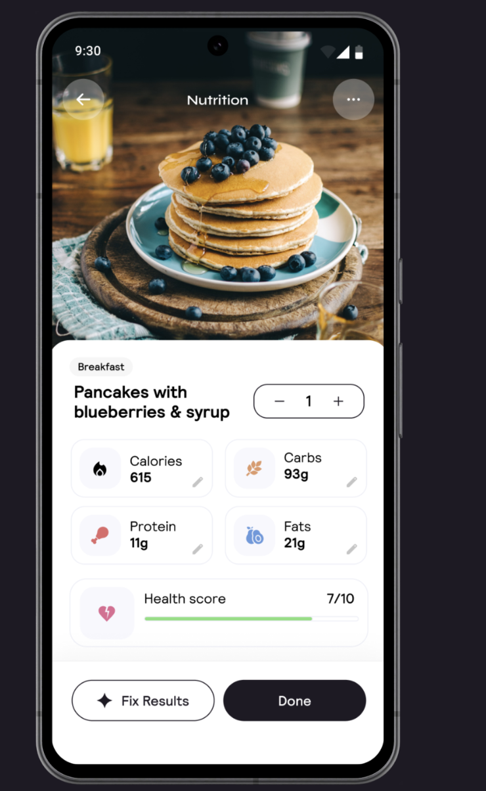
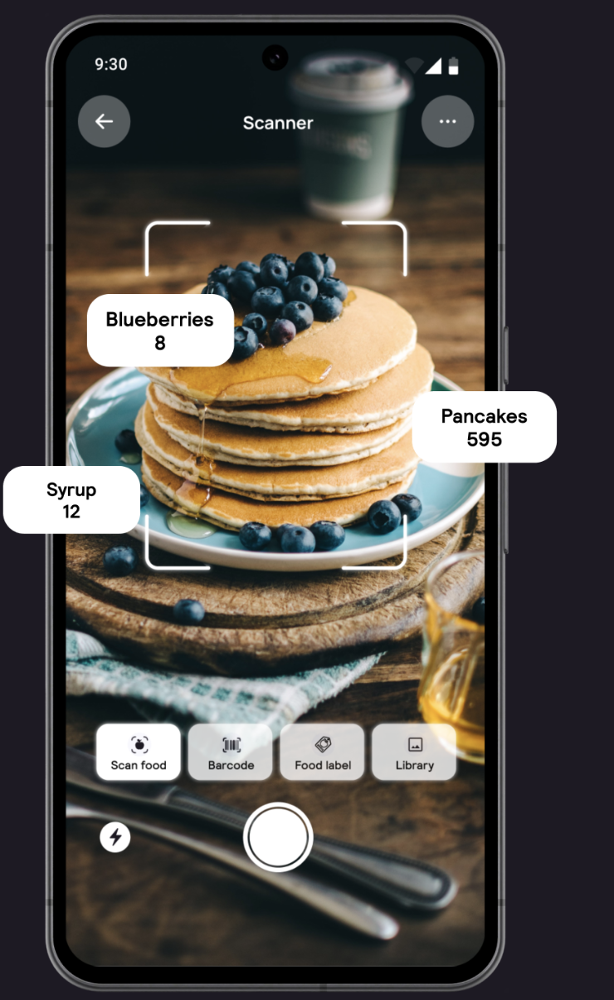
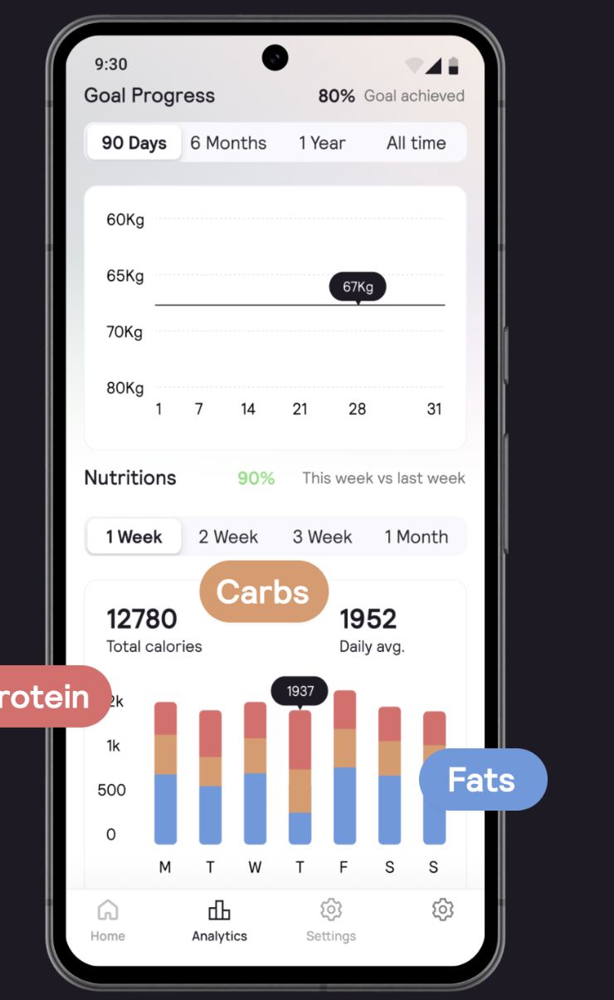
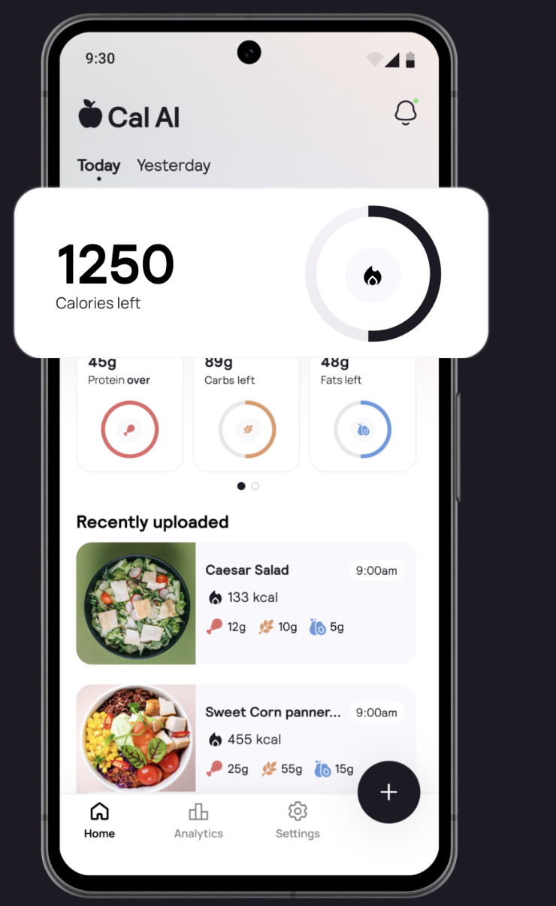

# nutriQ

**Problem**: Idag är det svårt att mata in data och skanna alla barkoder för olika varor. Detta leder till att färre personer vill följa sin kalori intag och väljer därför att inte gå vidare med smarta hälsoappar.

**Lösning**: För att snabbare lägga in information om maten, inför vi en skannings funktion av olika varor. Vid skanning av en produkt bearbetas information av en Ai funktion för att analysera mägenden mat och vad det är för mat.

- **Fotobaserad spårning**: Ta ett foto av din måltid, och AI analyserar bilden för att ge en omedelbar nedbrytning av kalorier, protein, kolhydrater och fetter.
- **Djupsensoranalys:** Appen använder din smartphones djupsensor för att uppskatta volymen av maten, vilket bidrar till en mer exakt näringsanalys.
- **Streckkod- och Etikettskanning:** För förpackade livsmedel kan du skanna streckkoder eller etiketter för att snabbt få fram näringsinformation.
- **Manuell Inmatning:** För komplexa rätter som smoothies eller soppor kan du manuellt beskriva din måltid för att få en exakt analys.
- **Personliga Planer:** Efter att ha besvarat livsstilsfrågor skapar Cal AI en anpassad näringsplan som är skräddarsydd efter dina mål.
- **Korrigering av Resultat:** Om AI:ns analys är felaktig kan du korrigera resultaten, vilket hjälper systemet att förbättras över tid.

#
#
#

    
    
    
    
    

